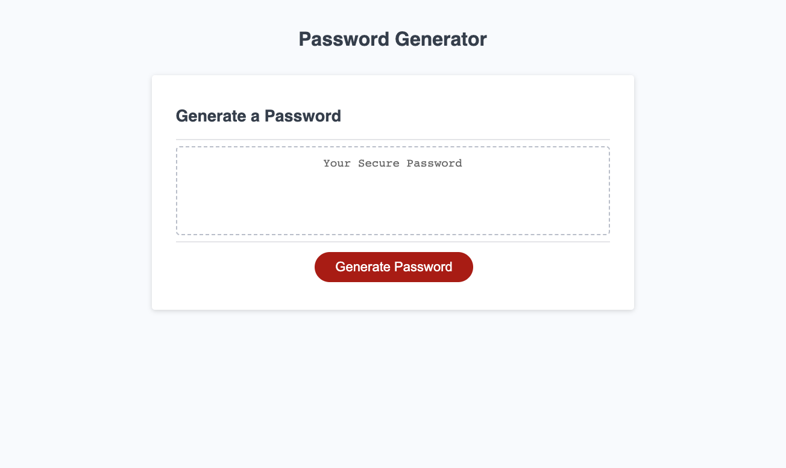

# Random Password Generator

## Description
This webpage contains a random password generator. 

I created this password generator to allows users to enter certain criteria in order to receive a password that matches the criteria.

In doing this, I demonstrated the use of various JavaScript tools.

## Installation

N/A

## Usage

Upon clicking the 'Generate Password' button, the user is asked to enter how many characters the password should contain. 
* The user can enter a number between 8 and 128. If a number outside that range is selected, they are notified of the requirement and asked to enter a new number.

Next, the user is asked to confirm whether or not to include a series of character types. 
* The character types include lowercase letters, uppercase letters, numbers, and special characters.
* At least one character type must be selected. If none are selected, the user receives an alert stating the requirement and then asked to confirm each character type again.

After inputting an acceptable length and confirming the use of at least one character type, a random password is generated.
* The user receives a randomly-generated password that matches their desired criteria. 
* The password displays inside the text area of the password generator.

## Credits

N/A

## Link to Deployed Website

[Random Password Generator](https://smdann.github.io/random-password-generator/)

## License

MIT License

Copyright (c) 2022 smdann

Please refer to the license in the repo for more information.